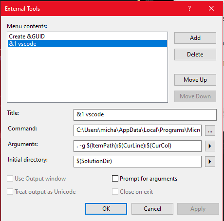

# Basic 

## Column Select 

### Adding 

**HINT:** alt-drag to select a column

transform the start: `1 => #1)` 

1 apple
2 orange
3 pear
4 kiwi
5 mango
6 grape
7 dragonfruit

### Deleting

delete the j and the two characters that follow

1 apjefple
2 orj*!ange
3 pej&Var
4 kijQtwi
5 majp@ngo
6 grj%9ape
7 drjlKagonfruit

# Advanced

## Setup Open w/ VS Code

unfortunately, multi-cursor support is pretty basic in Visual Studio. 
Our suggestion is to jump to VS Code whenever you have a more 
advanced multi-cursor use-case. 
Here's how to set up Visual Studio to this easily.

1. Go to Tools->External Tools...
2. Click "Add" 
3. Title: `&1 vscode`
4. Command: `"your\path\to\vscode\code.exe"`
5. Arguments: `. -g $(ItemPath):$(CurLine):$(CurCol)`
6. Initial directory: `$(SolutionDir)`
7. Click "OK"

In the end, it should look something like this:

After this, pressing the following key sequence (one at a time) `alt t 1` 
will open the current document in VS code at the current cursor position. 

## Word Select 

transform `1 apple => private string apple = "apple";`

**HINT:** alt-shift-drag selects a column in VS Code. 
**HINT:** ctrl-shift-➔ selects a word.
**HINT:** You can copy/paste columns of words.

1 apple
2 orange
3 pear
4 kiwi
5 mango
6 grape
7 dragonfruit
